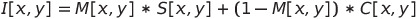
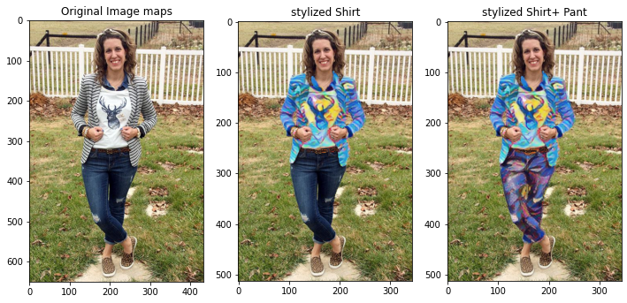

# Interactive Cloth Segmentation with Saliency Guided Style Transfer

### Try-it on Colab

## Methodology
### 1. Saliency map generation and Cloth Segmentation
We used a pre-trained U-2-Net model for [Cloth Segmentation](https://github.com/levindabhi/cloth-segmentation) & [Saliency Map generation](https://github.com/xuebinqin/U-2-Net) . The model was trained on [this dataset](https://www.kaggle.com/c/imaterialist-fashion-2019-FGVC6/data). The model accurately segments cloth components based on upper body cloth, lower body cloth, fully body cloth and background.

### 2. Neural Style Transfer
We used the method ([proposed here](https://arxiv.org/abs/1705.06830)), which combines the flexibility of the neural algorithm of artistic style with the speed of fast style transfer networks to allow real-time stylization using any content/style image pair. This specific method was used for its real-time capabilities to create styles quickly between content and style image pairing.

### 3. Blending the Stylized Image
For blending the stylised image, we exploited the saliency map, **M**, data. We wanted to have the stylized segmented component, **S**, blend with the content image, **C**. This required us to smooth out the edges **S** when using it as a mask for **C**. The saliency map, **M**, values ranged from **0-1**. When the saliency value was 1, we directly used the corresponding value from **S** on **C**. if it was between 0 and 1, we used the formula proposed [here](https://ieeexplore.ieee.org/abstract/document/8794904).

## Results

### Closer Look

Upon looking closer we can clearly see improvements made in the the visual quality of cloth boundaries compared to the pre-saliency blending. It can be seen from the two magnified images that the saliency-based blending helps to smooth the cloth boundary and to blend the stylized segmented cloth and background more naturally, especially when the colours are inconsistent near the cloth boundary.

